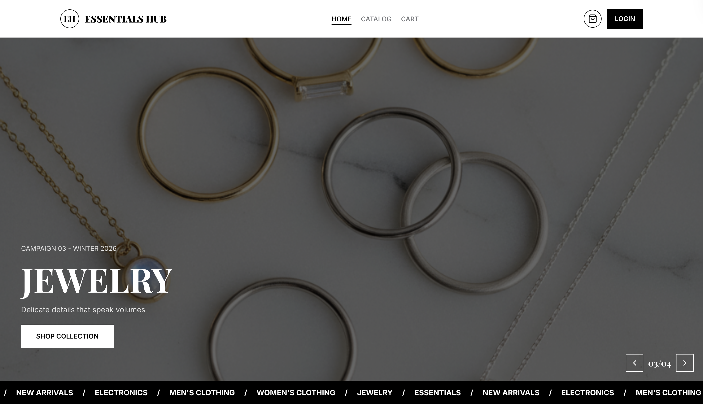

README

# Essentials Hub

## Description

_Essentials Hub_ is a modern and fully functional e-commerce web application built with React, designed to deliver a smooth and responsive online shopping experience. The store features a curated selection of clothing, electronics, and jewelry products with dynamic browsing, interactive UI elements, and seamless cart management.

This project was developed to demonstrate modern React front-end development concepts through the creation of a fully functional online store. The application focuses on dynamic state management, reusable component architecture, responsive design principles, client-side routing, and persistent application state. It also emphasizes clean UI structure, efficient rendering of product data, and seamless navigation between core e-commerce flows including product browsing, cart management, checkout, and order tracking.

## Features

- Responsive and modern user interface
- Product catalog with category browsing and filtering
- Dynamic product details page with quantity selection
- Functional shopping cart with quantity management
- Persistent cart state using Zustand
- Favorites/Wishlist system for saving products
- Full checkout flow with form validation using React Hook Form
- Order creation and order history tracking
- Success confirmation modal after checkout
- Smooth animations and interactive UI transitions
- Dedicated home page with featured sections
- Client-side routing for seamless navigation
- Not Found page for invalid routes

## Technologies Used

### Front-End

- ⁠React
- ⁠JavaScript
- ⁠CSS
- ⁠React Icons
- Sonner

### State Management

- Zustand (authentication, cart, favorites, orders)

### React Hooks

- useState
- useEffect
- useMemo
- useParams
- useNavigate
- useRef

### Tools Used

- ⁠VS Code
- ⁠Git
- ⁠GitHub
- ⁠NPM

## Key Implementation Details ⁠

- Built using React functional components and a reusable component-based architecture
- Implemented global state management using Zustand for cart, favorites, and orders
- Developed a full e-commerce flow: product browsing → cart → checkout → order history
- Created reusable UI components for product cards, forms, and summaries
- Implemented a dynamic product details page with API integration
- Used React Hook Form for form validation and error handling in checkout
- Integrated React Router for seamless client-side navigation between pages
- Designed responsive layouts using CSS Grid, Flexbox, and media queries
- Persisted cart and user interactions across sessions using Local Storage
- Implemented conditional rendering for empty states (cart, favorites, orders)
- Added success modal after checkout with navigation to orders page
- Optimized UI rendering using memoization (useMemo) for derived values like totals and related products

## Demo

Click [here](https://Fejiro001.github.io/essentials-hub) to demo
